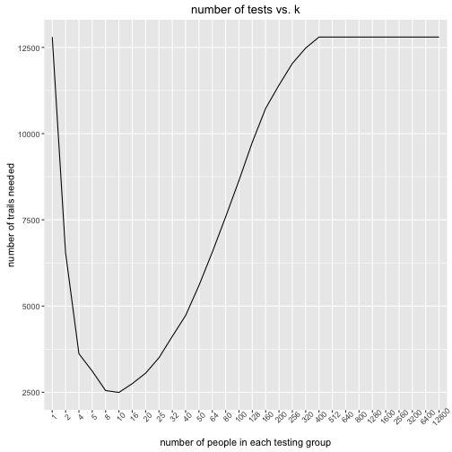
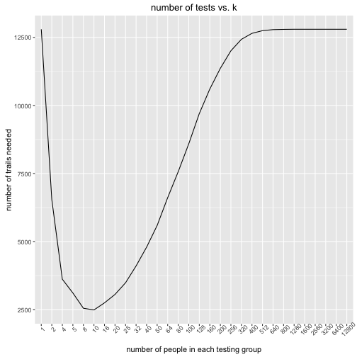

# Background
The goal of this project is to find the best strategy to diagnose people with Ebola with fewest tests. The varible need to be optimized is the number of blood works should be grouped to perform the first round test (defined as k for the rest of this report). If such group is tested positive for Ebola virus, then each member in that group will be tested individually in the second round. Two different approaches both using simulation are taken to meet the goal of this project. The first one find out optimal k by computing average number of tests needed on randomly simulated populational sample while the second approach compare all possible k on same simulated population sample for numbers of iterations. 

# Approaches
 Based on the given information, the infected population is binomially distributed with the rate of 0.011, and total number of bloodworks is 12,800. Sinces the number of groups has to be an interger, the number of bloodworks in each mixture is calculated as the all possible factors of total number of bloodworks.

```r
sample <- rbinom(12800,1,0.11)   # generate random samples 
ks <- factorize(n)   # generate possible factors of n as possible k
```
The first approach calculates average number of tests needed for each possible k for 200 different samples and compare the average number of tests needed across different k. The second approach calculate number of tests needed on samples with different ks and pick the best k of of each sample. 

# Result & Analysis


### First Approach
The for each possible k, 200 different samples are tested on each k and then the average number of tests are calculated for comparision between all possible k. To visualize the result, a line plot is constructed as following:



On the plot, average number of tests needed decreases first as k increase and reach to its minimal at k=10, and then rise up again. This result indicates that the optimal k is 10. However, there is a drawback in this method that number of tests needed for for k is calculated on different groups of samples can potentially lead to inconsistent or misleading result. Considering the simulation is repeated on 200 different samples, the variation between groups of samples given to each k can be negligible. 

### Second Approach
The second approach differs the first one, instead of running simulations on different ks with different samples, this approach calculate average number of tests needed of different ks of same sample at each iteration. In this case, for two different samples, the best k can be different. After simulate it on 200 different samples, the best k with highest occurence is the optimal global k. Similar to the first approach, a line plot is constructed to compare the average number of simulations versus different values of k. 


Based on this line plot, it reflects similar informations as it from the first approach. The optimal k with fewest number of tests is 10. 


### Conclusion
In summary, from the results of both approaches, k = 10 is the optimal solution to this particular problem. Bloodworks should be mixed in a group of 10 on the first round of tests, and then if tested positive, each individual in that need to be tested one by one. 


# Full Code

```r
library(ggplot2)

n = 12800            # number of donations
ratio = 0.011        # estimate infection rate
iterations = 200     # number of trial for each possible k

# this function calculates integer factors of a number
factorize <- function(x) {
  x <- as.integer(x)
  div <- seq_len(abs(x))
  factors <- div[x %% div == 0L]
  return(factors)
}

# this function calculates
calculate_times <- function(list,k){
  sum = 0
  for (i in 1:length(list)){
    if(sum(unlist(list[i]))==0){     # if the blood sample passes test
      sum = sum+1
    }else{                           # if the blood sample is infected
      sum = sum+k
    }
  }
  return(sum)
}

ks <- factorize(n)   # generate possible factors of n as possible k

min= n
output_k = c()
output_trial = c()
for(k in ks){
  pieces = n/k     # calculate number of groups based on k
  group = rep(1:pieces,each=k) # factors for sample split
  count = c()      # vector to contain all intermediate result
  for (l in 1:iterations){
    sample <- rbinom(n,1,ratio)   # generate random samples 
    sample_splits <- split(sample,group) # split sample
    count = c(count, calculate_times(sample_splits,k)) # calculate number of trails 
  }
  if(mean(count)<min){   # median
    min = mean(count)
    min_k = k
  }
  output_k <- c(output_k,k)
  output_trial <- c(output_trial,median(count))
}


# plot number of trials for different possible value of k
# notice x-axis as k -(number of people in each group) is factorized to make plot proportional
g <- ggplot()+geom_line(aes(x=as.factor(output_k),y=output_trial,group=1))
g <- g+xlab("number of people in each testing group")+ylab("number of trails needed")g <- g+xlab("number of people in each testing group")+ylab("number of trails needed")+ggtitle("number of tests vs. k")
g


optimal_k = c()
df = data.frame()
# second approach calculate what is the best possible k for different samples
for (i in 1:iterations){
  print(i)
  sample <- rbinom(n,1,ratio)   # generate random samples 
  count = c()      # vector to contain all intermediate result
  for(k in ks){
    pieces = n/k     # calculate number of groups based on k
    group = rep(1:pieces,each=k) # factors for sample split
    sample_splits <- split(sample,group) # split sample
    count = c(count, calculate_times(sample_splits,k)) # calculate number of trials needed for each k
  }
  local_best_n = min(count) # get the best k for each possible sample
  optimal_k <- c(optimal_k,ks[count==local_best_n])  # record the best k into vector
  df <- rbind(df,count)
}
names(df) <- ks

# line plot of # of tests vs. k
gg<- ggplot()+geom_line(aes(x=as.factor(ks),y=apply(df,2,mean)),group=1)
gg <- gg+xlab("number of people in each testing group")+ylab("number of trails needed")+ggtitle("number of tests vs. k")
gg

df_k <- as.data.frame(table(optimal_k))
names(df_k) <- c("k","occurance")

# pie plot on optimal k occurance
ggg <- ggplot(data = df_k,aes(x='',y=occurance,fill=k)) + geom_bar(width = 1,stat = 'identity')
ggg <- ggg + coord_polar("y", start=0)+xlab("")+ylab("")+ggtitle("occurance of optimal k")
ggg
```


