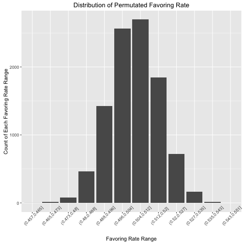

# Background
The task of this portfolio is to determine if a voting result is overturned because the voting process is tampered. In the specific case, among 8059 ballots returned, 1672 are not signed and therefore, disqualifed. The proposal is passed based on the signed votes: 3208 voted in favor and 3143 voted oppose. However, among the discounted votes, 730 were in favor and 942 were against. A jounalist suspect the voting result is tampered or the result is influenced by some external factors. The specific challenge of this project is to determine if the unproportional ratio between favor and against of the discounted votes are caused by randomness. 


# Approach
Assuming the counted portion of the votes are truely reflectory sample of people's opinion, the null hypothesis is that the favoring rate of the counted votes is equal to the favoring rate of the discounted votes. A permutation test on favoring rate is conducted to test this hypothesis. The idea of the permutation test is to draw many possible samples (idealy all possible combinations) from the counted votes with the size of discounted votes, in this case, 1672 out of 6351 and examine the favor rate of the sample. After numbers of same process, we can form a distribution of the favor rate and check the p-value of the observed discounted favor rate. 

# Analysis & Result
After performing the procedure discussed in the "Approach" section, number of possible favor ratio is ploted as a bar chart. 



Considering the discounted favoring rate being 43.66%, the distribution plot shos that, assuming the voted pool and discounted pool both reflect people's true opinions and share similar distribution, it is very unlikely for the discounted favoring rate being smaller than 0.452. In fact, after trying randomly drawing 1672 (number of discounted votes) out of 6351 (number of counted votes) for 10,000 times, none of those permutation records has a favoring rate smaller than the observed discounted favoring rate.

### Conclusion
After performing the permutation test on data, it is showing that statistically, it is very unlikely for the counted pool and the discounted pool both reflecting one true opinions of one population. This conclusion implies, it is very possible the result of the voting is tampered or there is some underlying causation between the lower favoring rate and higher discounted rate. Based on the testing result, I suggest the voting result should be disqualified and the proposal should be revoted. 


# Full Code

```r
library(ggplot2)

voted_favor = 3208
voted_oppose = 3143


test_favor = 730
test_oppose = 942
test_total = test_favor+test_oppose
test_favor_ratio = test_favor/test_total


n=10000   # set number of permutations
data = c(rep(1,voted_favor),rep(0,voted_oppose))

ratio_distrib = c()
for (i in 1:n){
  perm = sample(data,test_total)    # sample from counted votes
  perm_favor = sum(perm)            
  perm_favor_ratio = perm_favor/test_total   # calculate simulated favor rate
  ratio_distrib <- c(ratio_distrib,perm_favor_ratio)
}

ratio_min = min(ratio_distrib)
ratio_max = max(ratio_distrib)
step = (ratio_max-ratio_min)/10

range_distrib = cut(ratio_distrib,breaks=seq(ratio_min-step,ratio_max+step,step))
df <- as.data.frame(table(range_distrib))
names(df) <- c("range","count")

# construct distribution plot
ggplot(data=df,aes(x=range,y=count))+geom_bar(stat = "identity")+theme(axis.text.x = element_text(angle=45))

sum(ratio_distrib<test_favor_ratio)
```


